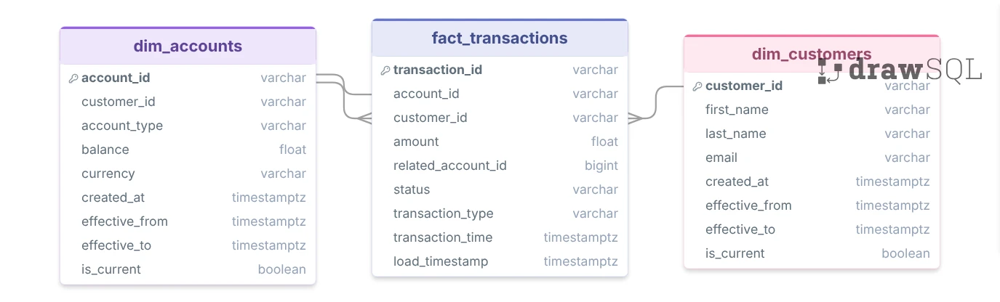
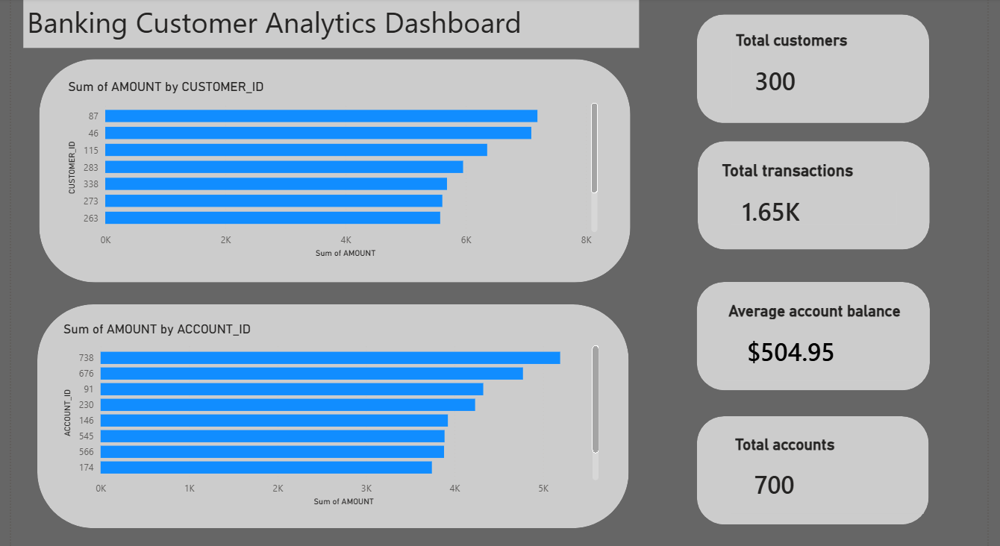

# 🏦 Banking data pipeline


---
## 📌 Project Overview
This project demonstrates an **end-to-end modern data stack pipeline** for a **Banking domain**.  
We simulate **customer, account, and transaction data**, stream changes in real time, transform them into analytics-ready models, and visualize insights — following **best practices of CI/CD and data warehousing**.

## 🏗️ Architecture  


---


**Pipeline Flow:**
1. **Data Generator** → Simulates banking transactions, accounts & customers (via Faker).  
2. **Kafka + Debezium** → Streams change data (CDC) into MinIO (S3-compatible storage).  
3. **Airflow** → Orchestrates data ingestion & snapshots into Snowflake.  
4. **Snowflake** → Cloud Data Warehouse (Bronze → Silver → Gold).  
5. **DBT** → Applies transformations, builds marts & snapshots (SCD Type-2).  
6. **CI/CD with GitHub Actions** → Automated tests, build & deployment.  

---

## ⚡ Tech Stack
- **Snowflake** → Cloud Data Warehouse  
- **DBT** → Transformations, testing, snapshots (SCD Type-2)  
- **Apache Airflow** → Orchestration & DAG scheduling  
- **Apache Kafka + Debezium** → Real-time streaming & CDC  
- **MinIO** → S3-compatible object storage  
- **Postgres** → Source OLTP system  
- **Python (Faker)** → Data simulation  
- **Docker & docker-compose** → Containerized setup  
- **Git & GitHub Actions** → CI/CD workflows  

---
## 🧩 Data Model (ER Diagram)

The banking platform is built around three core entities: **Customers**, **Accounts**, and **Transactions**.

The ER diagram below illustrates the relationships between the source OLTP tables used in the data pipeline.

<p align="center">
  
</p>

### Entity Relationships
- **Customer → Account** : One-to-Many
- **Account → Transaction** : One-to-Many
- Each customer can own multiple accounts.
- Each account can contain multiple transactions.

### Tables
| Table | Description |
|---------|------------|
| Customers | Customer profile and demographic information |
| Accounts | Account details and balances |
| Transactions | Financial transaction records |

---


## ✅ Key Features
- **PostgreSQL OLTP**: Source relational database with ACID guarantees (customers, accounts, transactions)  
- **Simulated banking system**: customers, accounts, and transactions  
- **Change Data Capture (CDC)** via Kafka + Debezium (capturing Postgres WAL)  
- **Raw → Staging → Fact/Dimension** models in DBT  
- **Snapshots for history tracking** (slowly changing dimensions)  
- **Automated pipeline orchestration** using Airflow  
- **CI/CD pipeline** with dbt tests + GitHub Actions  

---

## 📂 Repository Structure
```text
banking-modern-datastack/
├── .github/workflows/         # CI/CD pipelines (ci.yml, cd.yml)
├── banking_dbt/              # DBT project
│   ├── models/
│   │   ├── staging/           # Staging models
│   │   ├── marts/             # Facts & dimensions
│   │   └── sources.yml
│   ├── snapshots/             # SCD2 snapshots
│   └── dbt_project.yml
├── consumer
│   └── kafka_to_minio.py
├── data-generator/            # Faker-based data simulator
│   └── faker_generator.py
├── docker/                    # Airflow DAGs, plugins, etc.
│   ├── dags/                  # DAGs (minio_to_snowflake, scd_snapshots)
├── kafka-debezium/            # Kafka connectors & CDC logic
│   └── generate_and_post_connector.py
├── postgres/                  # Postgres schema (OLTP DDL & seeds)
│   └── schema.sql
├── .gitignore
├── docker-compose.yml         # Containerized infra
├── dockerfile-airflow.dockerfile
├── requirements.txt
└── README.md
```

---

## ⚙️ Step-by-Step Implementation  

### **1. Data Simulation**  
- Generated synthetic banking data (**customers, accounts, transactions**) using **Faker**.  
- Inserted data into **PostgreSQL (OLTP)** so the system behaves like a real transactional database (**ACID, constraints**).  
- Controlled generation via `config.yaml`.  

---

### **2. Kafka + Debezium CDC**  
- Set up **Kafka Connect & Debezium** to capture changes from **Postgres**.  
- Streamed **CDC events** into **MinIO**.  

---

### **3. Airflow Orchestration**  
- Built DAGs to:  
  - Ingest **MinIO data → Snowflake (Bronze)**.  
  - Schedule **snapshots & incremental loads**.  

---

### **4. Snowflake Warehouse**  
- Organized into **Bronze → Silver → Gold layers**.  
- Created **staging schemas** for ingestion.  

---

### **5. DBT Transformations**  
- **Staging models** → cleaned source data.  
- **Dimension & fact models** → built marts.  
- **Snapshots** → tracked history of accounts & customers.  

---

### **6. CI/CD with GitHub Actions**  
- **ci.yml** → Lint, dbt compile, run tests.  
- **cd.yml** → Deploy DAGs & dbt models on merge.  

---

## 📊 Final Deliverables  
- **Automated CDC pipeline** from Postgres → Snowflake  
- **DBT models** (facts, dimensions, snapshots)  
- **Orchestrated DAGs in Airflow**  
- **Synthetic banking dataset** for demos  
- **CI/CD workflows** ensuring reliability  

---

## 📊 Banking Customer & Transaction Analytics Dashboard

The final analytics layer is visualized through an interactive **Power BI Dashboard** built on top of the transformed **Gold Layer** tables in Snowflake.

<p align="center">
  
</p>

### Dashboard Insights
- Top customers by transaction volume.
- Top accounts by transaction amount.
- Customer transaction distribution analysis.
- Account balance monitoring.
- Banking performance KPI tracking.

### Data Source
Power BI → Snowflake Gold Layer → DBT Models → Airflow Pipeline → CDC Stream (Kafka + Debezium)
---

**Author**: *Sudharshan ram Jayaraman*  
**Contact**: [jsudharshan07@gmail.com](mailto:jsudharshan07@gmail.com)  